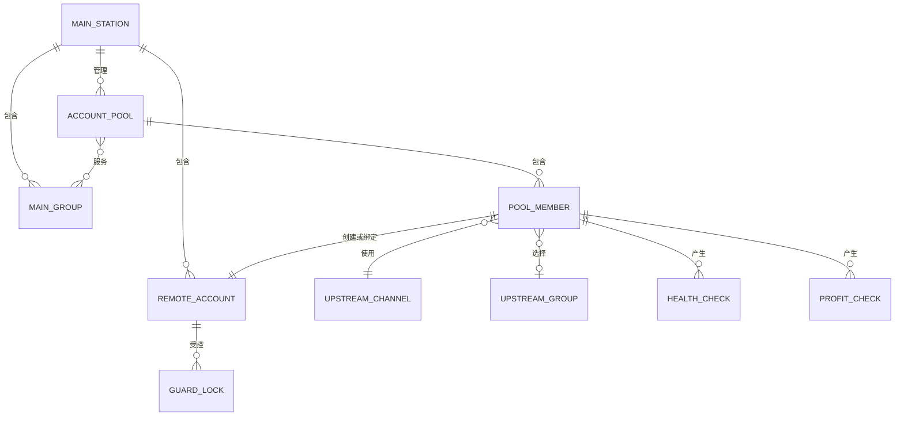
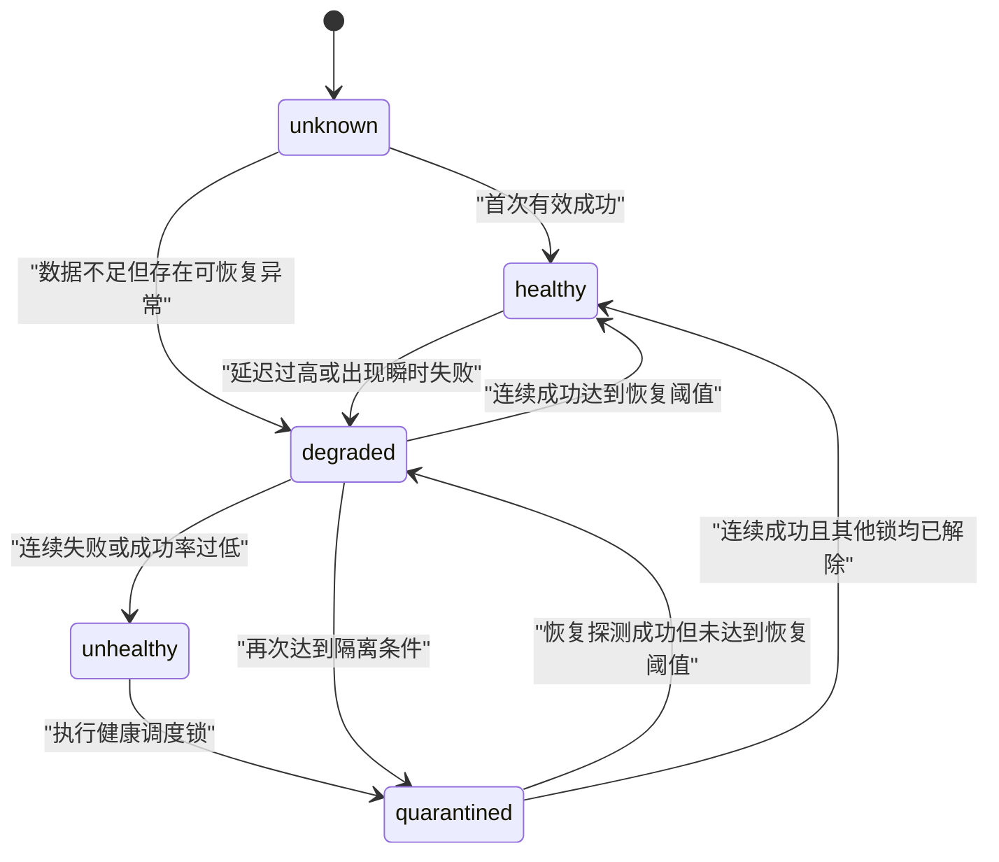

# 主站账号池、成本风控与稳定性监控需求文档

## 1. 文档信息

| 项目 | 内容 |
| --- | --- |
| 文档状态 | 需求探索稿，可用于技术设计和任务拆分 |
| 目标项目 | UpstreamOps |
| 主站类型 | Sub2API |
| 上游类型 | Sub2API、NewAPI，以及兼容 OpenAI/Anthropic API 的站点 |
| 编写日期 | 2026-07-17 |
| 主要目标 | 将现有“上游动态同步”扩展为可管理主站账号池、持续测活、成本核算和自动止损的运维系统 |

## 2. 背景

当前 UpstreamOps 主要负责多个 NewAPI/Sub2API 上游渠道的余额、消费、倍率、公告和订阅监控，并已具备向 Sub2API 目标站点创建账号、同步模型、更新倍率和测试账号的能力。

现有“上游动态同步”采用以下模式：

1. 选择一个源渠道和源分组。
2. 在源渠道创建或复用一个 API Key。
3. 在目标 Sub2API 中创建一条 Account。
4. 将该 Account 绑定到一个或多个目标分组。
5. 保存源渠道、源分组、源 API Key 和目标 Account 的托管映射。

该模式解决了账号创建和配置同步，但还不能作为完整的主站供应侧管理系统，主要缺少：

- 只能管理同步器自动创建的账号，不能显式绑定主站中已有的账号。
- 没有“主站”这一单例业务概念，目标 Sub2API 可以添加多个。
- 没有“逻辑账号池”视图，无法统一观察多个供应成员的成本、容量和健康情况。
- 测试只发生在应用同步时，没有持续的成功率、延迟和故障历史。
- 没有低 Token 测活策略，直接频繁调用主站账号测试接口可能造成不必要的成本。
- 没有将主站销售倍率与上游真实成本倍率进行持续比较。
- 没有统一的调度锁；同步、健康检查和利润保护可能互相覆盖账号状态。
- 没有自动止损、恢复确认、审计记录和池容量告警。

## 3. 产品目标

### 3.1 核心目标

1. 系统只允许配置一个 Sub2API 主站。
2. 将现有同步分组演进为“主站账号池”。
3. 一个账号池可以包含多个上游成员，并服务一个或多个主站分组。
4. 每个池成员对应主站后台一条独立 Account，可自动创建，也可绑定已有 Account。
5. 持续采集池成员的真实成本、健康状态、成功率和延迟。
6. 发现亏损或持续故障时通知，并按策略暂停对应主站 Account 调度。
7. 保证同步器、健康检查、利润保护和人工操作不会互相错误覆盖。
8. 所有自动操作必须可解释、可审计、可手工解除。

### 3.2 非目标

第一阶段不包含以下能力：

- 不把 UpstreamOps 变成模型请求代理或流量转发网关。
- 不修改 Sub2API 的 Account 凭证结构以支持单 Account 多 API Key。
- 不实现请求级别的自定义调度算法，实际请求调度继续由主站 Sub2API 完成。
- 不自动调整主站用户余额、套餐价格或用户专属倍率。
- 不对订阅套餐、图片、视频、按次计费等复杂商品自动计算完整财务利润。
- 不在数据不完整或倍率口径无法确认时自动停用账号。

## 4. 关键约束与设计结论

### 4.1 逻辑账号池不等于一条 Sub2API Account

Sub2API 一条 Account 只有一套核心上游凭据：

```json
{
  "base_url": "https://upstream.example.com",
  "api_key": "sk-xxx"
}
```

因此一个真实 Account 无法同时准确表示多个不同的上游地址和 API Key。Sub2API 的 `pool_mode` 仅控制同一 Account 遇到部分错误时的原地重试，不是多凭据池。

本需求中的“主站账号池”是 UpstreamOps 的逻辑管理对象，在主站中应落成多条独立 Account：

```text
主站账号池
├── 池成员 A -> 主站 Account A -> 上游 A
├── 池成员 B -> 主站 Account B -> 上游 B
└── 池成员 C -> 主站 Account C -> 上游 C
```

这些 Account 绑定到相同主站分组，由 Sub2API 原生调度器完成请求分配。

### 4.2 一条主站 Account 只能对应一个池成员

第一阶段强制以下唯一关系：

```text
(main_station_id, remote_account_id) 唯一
```

即一条主站 Account 不能同时绑定多个池成员。这样才能唯一确定：

- 实际上游渠道和分组。
- 上游成本倍率。
- 测活目标。
- 故障归属。
- 自动停用对象。

### 4.3 一个池成员可以服务多个主站分组

Sub2API Account 可以绑定多个主站分组，因此池成员可以同时服务多个分组。利润判断必须按“池成员 × 主站分组”分别计算。

由于 `schedulable` 是 Account 全局开关，如果一个池成员在任意主站分组中亏损，第一阶段默认全局暂停该 Account。后续版本可增加“仅解绑亏损分组”的高级模式。

## 5. 术语

| 术语 | 定义 |
| --- | --- |
| 主站 | 用户自己运营的唯一 Sub2API 站点 |
| 主站分组 | 主站中面向用户计费和调度的 Group |
| 上游渠道 | UpstreamOps 中现有的 Channel，包含上游站点地址和登录凭据 |
| 上游分组 | 上游账号可用的计费分组，决定该账号调用上游时的倍率 |
| 主站账号 | 主站 Sub2API 后台账号管理中的一条 Account，不是主站用户账号 |
| 主站账号池 | UpstreamOps 中的逻辑对象，聚合一组共同服务相同主站分组的池成员 |
| 池成员 | 一组“上游渠道 + 上游分组 + 主站 Account”的确定绑定 |
| 托管成员 | 由 UpstreamOps 创建源 API Key 和主站 Account，并持续维护其配置的池成员 |
| 绑定成员 | 主站 Account 已存在，UpstreamOps 只建立映射并监控，不默认接管凭据和删除行为 |
| 销售倍率 | 主站向用户扣费使用的有效倍率 |
| 成本倍率 | 主站 Account 使用对应上游 API Key 调用时的有效倍率 |
| 调度锁 | 阻止主站 Account 被启用的持久化原因，例如亏损、健康异常、人工停用 |
| 测活 | 使用零生成或极少 Token 的请求验证账号鉴权、模型和推理链路 |

## 6. 用户角色与权限

系统仍为单管理员运维工具，所有主站管理接口必须走 UpstreamOps 后台鉴权。

管理员可以：

- 配置、更新和测试唯一主站。
- 同步主站分组和账号。
- 创建、编辑、删除账号池。
- 创建池成员或绑定已有主站 Account。
- 设置测活和利润保护策略。
- 手工执行检测、停用、恢复和解除锁定。
- 查看测活历史、利润历史、通知和自动操作审计。

未登录用户不能读取主站地址、账号映射、错误详情和任何密钥状态。

## 7. 总体业务模型



## 8. 核心用户流程

### 8.1 首次配置主站

1. 管理员进入“主站管理”。
2. 填写主站名称、Base URL 和 Admin API Key。
3. 系统加密保存 Admin API Key。
4. 系统调用主站管理员接口读取分组和账号，验证权限范围。
5. 连接成功后建立唯一主站配置。
6. 系统同步主站分组和主站 Account 快照。

约束：

- 主站最多一条。
- 更新 Admin API Key 时，空值表示保留旧密钥。
- 删除主站前必须确认如何处理账号池和绑定，不允许静默级联删除远端对象。

### 8.2 创建账号池

1. 输入池名称和说明。
2. 选择池要服务的一个或多个主站分组。
3. 设置池最小健康成员数和最小有效并发。
4. 设置默认倍率换算、健康策略和利润策略。
5. 保存后创建空池。

### 8.3 添加托管池成员

1. 在账号池中点击“添加成员”。
2. 选择已有上游渠道。
3. 同步并选择上游分组。
4. 选择或创建源 API Key。
5. 设置平台、模型映射、代理、权重、并发和优先级。
6. 系统在主站创建独立 Account，并绑定账号池对应的主站分组。
7. 系统保存源 API Key、主站 Account 和池成员之间的精确映射。
8. 系统执行首次 L0 和 L1 检测，必要时执行一次 L2 检测。
9. 只有检测通过且无调度锁时，Account 才允许进入调度。

### 8.4 绑定已有主站 Account

1. 在添加成员时选择“绑定已有主站账号”。
2. 系统列出尚未绑定的主站 Account。
3. 管理员选择上游渠道和上游分组。
4. 系统比较主站 Account 的非敏感 `base_url` 与上游渠道地址。
5. 若地址一致且已有托管映射，标记为“已验证”。
6. 若无法验证 API Key 身份，显示风险提示并要求管理员显式确认，标记为“人工确认”。
7. 保存后不得自动覆盖该 Account 的凭据，除非管理员切换为托管模式。

### 8.5 删除成员

删除行为按成员类型区分：

- 托管成员：默认只从池中移除并暂停调度；删除主站 Account、删除源 API Key 必须单独勾选并二次确认。
- 绑定成员：默认只解除本地绑定，绝不自动删除主站 Account 或源 API Key。

如果成员仍有活动调度锁或最近存在自动操作，界面必须展示影响摘要。

## 9. 主站数据同步需求

### 9.1 主站分组同步

同步字段至少包括：

- 远端分组 ID。
- 名称、说明、平台和状态。
- 基础 `rate_multiplier`。
- 高峰倍率开关、时段和倍率。
- 订阅类型。
- 图片、视频独立倍率标志。
- 更新时间和最后同步时间。

系统还应读取 `GET /api/v1/admin/groups/:id/rate-multipliers`，用于识别用户专属倍率。利润保护使用活动用户中的最低有效倍率作为保守销售倍率。

### 9.2 主站 Account 同步

必须支持完整分页，不允许只读取第一页或固定前 100 条。

同步字段至少包括：

- 远端 Account ID、名称、备注。
- 平台、类型、状态和 `schedulable`。
- 并发、优先级、权重和 `rate_multiplier`。
- 所属主站分组 ID。
- 非敏感凭据字段，例如 `base_url`。
- 凭据存在状态，不保存管理员接口返回的脱敏占位字符串。
- `extra.upstream_billing_probe` 快照。
- 最近使用时间、错误信息和更新时间。

远端 Account 消失时：

- 本地池成员标记为 `orphaned`。
- 停止自动写远端。
- 发送一次绑定失效通知。
- 保留历史记录，不直接删除绑定。

## 10. 账号池需求

### 10.1 基础字段

账号池至少包含：

- 名称和说明。
- 是否启用。
- 目标主站分组集合。
- 平台。
- 默认权重、并发、优先级策略。
- 最小健康成员数。
- 最小有效并发。
- 倍率排序方向。
- 健康检查策略。
- 利润保护策略。
- 最近评估状态和时间。

### 10.2 池成员状态

成员业务状态：

| 状态 | 含义 |
| --- | --- |
| pending | 已保存但尚未完成首次同步和检测 |
| active | 绑定完整，可参与调度判定 |
| degraded | 仍可用，但延迟、成功率或容量异常 |
| quarantined | 因健康或利润原因被隔离 |
| disabled | 管理员主动禁用 |
| orphaned | 主站 Account 或上游渠道已不存在 |
| error | 同步或配置错误，需要人工处理 |

成员状态不直接等于主站 Account 的 `status` 或 `schedulable`，最终调度状态由统一规则计算。

### 10.3 池整体状态

| 状态 | 判定 |
| --- | --- |
| healthy | 健康且盈利成员数、有效并发都达到阈值 |
| degraded | 仍有可用成员，但成员数或容量低于目标 |
| critical | 没有健康且盈利的可调度成员 |
| unknown | 数据不足、主站离线或尚未完成首次评估 |

池总览需要展示：

- 总成员数。
- 健康成员数。
- 盈利成员数。
- 可调度成员数。
- 有效总并发。
- 最低、最高和加权平均成本倍率。
- 最近 24 小时成功率。
- P50/P95 延迟。
- 最近一次风险事件。

## 11. 低 Token 测活需求

### 11.1 目标

测活必须同时满足：

- 尽量少消耗上游 Token 和余额。
- 能区分网络、鉴权、分组、模型和推理故障。
- 能按主站 Account 精确归属故障。
- 不能因一次瞬时错误频繁启停账号。
- 能统计稳定性，而不是只保存最后一次结果。

### 11.2 测活分层

#### L0：零生成 Token 探测

建议频率：2–5 分钟，支持抖动。

Sub2API 上游优先调用：

```text
GET /v1/sub2api/billing
GET /v1/models
```

NewAPI/兼容上游可调用：

```text
GET /v1/models
GET /api/user/self/groups
```

验证范围：

- DNS、TLS、网络和代理。
- API Key 是否有效。
- 分组是否存在。
- 倍率是否可读取。
- 模型列表是否可读取。

L0 成功不能证明推理链路正常，只能作为低成本基础可用性证据。

#### L1：极小推理探测

建议频率：15–30 分钟，按成员配置，并加入随机抖动。

请求必须使用池成员配置的低成本测试模型，不允许简单取模型列表第一项。推荐请求：

OpenAI Chat Completions：

```json
{
  "model": "configured-test-model",
  "messages": [{"role": "user", "content": "Reply OK"}],
  "max_tokens": 4,
  "stream": false
}
```

OpenAI Responses：

```json
{
  "model": "configured-test-model",
  "input": "Reply OK",
  "max_output_tokens": 8,
  "stream": false
}
```

Anthropic Messages：

```json
{
  "model": "configured-test-model",
  "messages": [{"role": "user", "content": "Reply OK"}],
  "max_tokens": 4,
  "stream": false
}
```

Gemini：使用 `maxOutputTokens=8`。

兼容性要求：

- 某些推理模型存在最低输出限制，不能强制所有模型只输出 1 Token。
- 如果上游拒绝过小的输出限制，应记录为“测试配置不兼容”，不能直接判定账号故障。
- 禁止自动删除输出限制后无限重试。
- 每次检测最多进行一次兼容性降级重试。

#### L2：主站指定 Account 链路验证

建议频率：6–24 小时，或在以下事件后触发：

- 新建或重新绑定成员。
- 修改主站 Account 凭据、代理、模型映射或分组。
- L0 成功但 L1 连续失败。
- 管理员手工触发。

通过主站管理员接口调用：

```text
POST /api/v1/admin/accounts/:id/test
```

L2 用于验证：

- 主站 Account 配置。
- 主站代理。
- 模型映射。
- 主站到上游的实际转发。
- 目标 Account 是否能被单独调用。

官方 Account Test 请求不保证最低 Token，因此不得高频执行。后续如果主站 Sub2API 增加专用轻量测试参数，可将 L2 的输出上限进一步收紧。

### 11.3 测活对象选择

默认检测范围：

- 主站 Account `status=active`。
- Account 绑定了至少一个启用的主站分组。
- 池成员启用了健康检查。

以下情况仍可执行低频恢复探测：

- 因健康原因被隔离。
- 因临时限流进入冷却。

以下情况默认不自动测活：

- 管理员手工禁用。
- 绑定已失效。
- 上游凭据缺失。
- 仅因利润保护被锁定且管理员关闭恢复探测。

### 11.4 测活结果字段

每次检测至少记录：

- 池、成员、上游渠道和主站 Account ID。
- 检测层级 L0/L1/L2。
- 协议、模型和 endpoint。
- 开始、结束时间和耗时。
- HTTP 状态码。
- 结果状态和错误分类。
- 响应摘要，必须脱敏并限制长度。
- 输入、输出和总 Token；上游未返回 usage 时记录为未知。
- 估算成本。
- 是否触发状态迁移、通知或调度操作。

### 11.5 稳定性状态机



默认策略建议：

| 错误类型 | 默认动作 |
| --- | --- |
| 401、确定的密钥失效 | 立即加健康锁并通知 |
| 403、确定的权限或封禁 | 立即加健康锁并通知 |
| 402、余额不足 | 立即加健康锁并通知 |
| 429、明确限流 | 进入冷却，不永久判故障 |
| Timeout、连接失败、5xx | 连续 3 次失败后加健康锁 |
| HTTP 2xx 但响应为空或校验失败 | 连续 2 次失败后加健康锁 |
| 延迟高于阈值 | 标记 degraded，不立即停用 |
| 测试模型不支持或输出限制不兼容 | 标记配置异常，不作为账号故障 |

恢复默认要求：

- 连续 3 次成功。
- 最近窗口成功率达到策略阈值。
- 不存在利润锁、人工锁、同步锁和凭据锁。
- 自动恢复开关已开启；否则仅通知管理员可恢复。

### 11.6 稳定性指标

按成员统计：

- 最近一次状态。
- 连续成功和失败次数。
- 最近 20 次成功率。
- 1 小时、24 小时、7 天成功率。
- 平均、P50 和 P95 延迟。
- 最后成功时间和最后失败时间。
- 最近错误类型和错误摘要。
- 每日测试次数、Token 和估算成本。

## 12. 测活预算与调度保护

系统必须支持以下限制：

- 全局最大测活并发。
- 单上游渠道最大并发。
- 单主站最大并发。
- 每个成员最短检测间隔。
- 随机抖动，避免同一时刻打满所有上游。
- 每日最大 L1/L2 检测次数。
- 每日最大估算测试 Token 或成本。
- 达到预算后暂停 L1/L2，但继续执行必要的 L0 探测并通知管理员。
- 相同成员已有检测运行时，不重复启动。
- 服务重启后不得同时补跑所有错过的检测。

## 13. 成本倍率来源

成本倍率按以下优先级解析：

1. 主站 Account 的新鲜 `extra.upstream_billing_probe.data.effective_rate_multiplier`。
2. 池成员明确绑定的上游渠道和分组的最新 `RateSnapshot`。
3. 同步器托管映射中保存的源渠道和源分组。
4. 管理员为池成员配置的手工成本倍率。
5. 主站 Account `rate_multiplier`，仅作为估算展示，默认不能触发自动停用。

来源必须展示并持久化，例如：

```text
sub2api_billing_probe
source_rate_snapshot
managed_binding
manual_override
remote_account_estimate
```

成本快照必须带采集时间和过期时间。过期数据不得触发新的自动停用。

## 14. 利润计算需求

### 14.1 基础公式

```text
主站有效销售倍率 = 主站最低用户有效倍率 × 当前主站高峰倍率
上游有效成本倍率 = 上游有效倍率 × 成本修正系数
绝对差值 = 主站有效销售倍率 - 上游有效成本倍率
利润率 = 绝对差值 / 主站有效销售倍率
```

成本修正系数用于表达充值折扣、币值换算等倍率之外的真实采购差异，默认值为 1。

### 14.2 判断粒度

利润检查对象为：

```text
池成员 × 主站分组
```

同一个池成员服务多个主站分组时，每个组合单独产生利润结果。

### 14.3 默认风险条件

满足以下全部条件时判定为利润风险：

- 主站分组启用。
- 池成员启用。
- 销售和成本倍率都已确认且未过期。
- 倍率单位已经完成换算。
- `利润率 < 最低利润率阈值`。

最低利润率默认建议为 0%，生产使用建议配置为 3%–5%。

### 14.4 不允许自动判定的场景

- 主站分组为订阅计费，收入不是按 Token 倍率线性计算。
- 图片或视频使用独立倍率。
- 上游按请求计费或有复杂阶梯价。
- 主站存在无法读取的用户专属倍率。
- 成本倍率来源仅为未确认的 Account `rate_multiplier`。
- 数据已过期或换算规则不明确。

上述场景显示“无法自动评估”，允许人工设置固定销售或成本参数后重新启用评估。

## 15. 调度锁与最终调度状态

### 15.1 锁类型

| 锁 | 来源 |
| --- | --- |
| manual | 管理员手工暂停 |
| margin | 利润低于阈值 |
| health | 持续测活失败 |
| sync | 同步、模型更新或配置应用失败 |
| credential | 上游凭据失效或缺失 |
| binding | 绑定失效或远端 Account 不存在 |

每种锁独立创建和解除。任何模块不得直接清除不属于自己的锁。

### 15.2 最终调度公式

```text
desired_schedulable =
    pool.enabled
    AND member.enabled
    AND remote_account.status == active
    AND binding.valid
    AND active_guard_lock_count == 0
```

只有 `desired_schedulable=true` 时，系统才能向主站写入 `schedulable=true`。

### 15.3 同步器改造要求

现有同步器不能再根据远端 Account `status=active` 直接启用调度。同步、测试恢复和手工恢复都必须调用统一的调度决策服务。

要求：

- 同步器应用配置后重新计算 `desired_schedulable`。
- 测活成功只解除 `health` 锁。
- 利润恢复只解除 `margin` 锁。
- 管理员恢复只解除选定锁或明确执行“解除全部自动锁”。
- 写远端前再次读取最新锁状态，避免并发竞态。
- 写入失败保留锁并记录审计，不假装操作成功。

## 16. 自动停用与恢复

### 16.1 自动停用

默认执行流程：

1. 产生风险检查结果。
2. 达到连续样本和新鲜度要求。
3. 原子创建对应调度锁。
4. 再次获取主站 Account 最新状态。
5. 调用 `POST /api/v1/admin/accounts/:id/schedulable` 写入 `false`。
6. 记录操作前后状态。
7. 发送包含原因、证据和操作结果的通知。

利润风险建议第一次发现立即通知，连续两次确认后停用。明确的 401、403、402 可按策略立即停用。

### 16.2 自动恢复

默认关闭自动恢复，只发送恢复提示。

开启自动恢复后仍必须满足：

- 对应风险已连续恢复到阈值以上。
- 达到恢复成功次数。
- 所有其他调度锁均已解除。
- 主站 Account 仍然存在且状态为 active。
- 绑定未发生变化。

自动恢复必须记录独立审计和通知。

## 17. 通知需求

新增通知事件建议：

```text
main_pool_degraded
main_pool_critical
main_member_health_failed
main_member_health_recovered
main_member_margin_risk
main_member_margin_recovered
main_member_disabled
main_member_reenabled
main_member_binding_lost
main_station_sync_failed
health_probe_budget_exceeded
```

通知内容至少包含：

- 主站、账号池和成员名称。
- 主站 Account 名称和 ID。
- 上游渠道和分组。
- 影响的主站分组。
- 销售倍率、成本倍率、利润率和数据时间。
- 测活层级、模型、错误类型、连续失败次数和延迟。
- 执行动作及结果。
- 是否需要人工处理。

通知去抖键不能只使用上游渠道 ID，应至少包含：

```text
event + pool_id + member_id + main_group_id
```

恢复通知与故障通知分别去抖。

## 18. 审计需求

必须记录以下操作：

- 主站创建、修改、密钥更新和连接测试。
- 主站数据同步。
- 账号池创建、修改和删除。
- 成员创建、绑定、解绑和删除。
- 远端 Account 创建、更新、停用和恢复。
- 源 API Key 创建、更新和删除。
- 调度锁创建和解除。
- 测活策略和利润策略修改。
- 自动和手工执行的全部保护动作。

审计记录字段：

- 操作类型和来源：manual、scheduler、syncer、health、margin。
- 资源类型和 ID。
- 操作前后状态摘要。
- 判断依据快照。
- 成功、失败和错误摘要。
- 操作时间。

严禁写入明文密码、Token、Cookie、Admin API Key 和完整上游 API Key。

## 19. 页面与交互需求

### 19.1 导航

新增一级“主站”页面，不应继续完全隐藏在系统设置中。建议包含：

- 总览。
- 账号池。
- 主站账号。
- 主站分组。
- 测活记录。
- 风控与审计。

### 19.2 主站总览

展示：

- 主站连接状态和最后同步时间。
- 分组数、Account 数、可调度 Account 数。
- 健康、降级、风险和隔离成员数。
- 当前 critical 账号池。
- 最近自动停用和恢复事件。
- 今日测活 Token 和估算成本。

### 19.3 账号池列表

使用密集表格或分组列表，字段包括：

- 池名称和服务分组。
- 成员总数、健康数、盈利数和可调度数。
- 有效并发。
- 成本范围和最低利润率。
- 24 小时成功率和 P95 延迟。
- 池状态。
- 刷新、编辑、添加成员和查看详情操作。

### 19.4 池详情

成员表字段：

- 成员和上游渠道。
- 上游分组。
- 主站 Account。
- 主站分组。
- 权重、优先级和并发。
- 成本来源和倍率。
- 最低利润率。
- L0/L1/L2 状态。
- 最近成功、连续失败和 P95 延迟。
- 调度锁和最终调度状态。

支持：

- 添加成员。
- 绑定已有 Account。
- 手工执行 L0/L1/L2。
- 手工暂停和恢复。
- 查看成本、测活和操作历史。
- 批量检测，但必须显示预计请求数和预算影响。

### 19.5 配置保护

- 自动停用默认关闭，管理员完成至少一次只读评估后才能开启。
- 开启自动停用前显示受影响成员、当前阈值和测试覆盖率。
- 删除远端 Account 或源 API Key 必须二次确认。
- 批量恢复前显示仍存在的其他调度锁。

## 20. 建议数据模型

以下为逻辑模型，具体字段可在技术设计阶段按现有 GORM 风格调整。

### 20.1 `main_station_configs`

```text
id                       固定单例 ID
target_id                关联 upstream_sync_targets，复用加密 Admin API Key
enabled
last_sync_status
last_sync_at
last_sync_error
created_at
updated_at
```

### 20.2 `main_account_pools`

```text
id
name                     唯一
description
platform
enabled
minimum_healthy_members
minimum_effective_concurrency
health_policy_json
margin_policy_json
last_status
last_evaluated_at
created_at
updated_at
```

### 20.3 `main_account_pool_groups`

```text
pool_id
target_group_id          关联 upstream_sync_target_groups
created_at
PRIMARY KEY(pool_id, target_group_id)
```

### 20.4 `main_account_pool_members`

```text
id
pool_id
source_channel_id
source_group_id          Sub2API 可用；NewAPI 可为空
source_group_name
source_api_key_id
remote_account_id
remote_account_name
ownership_mode           managed / bound
binding_status           verified / manual_confirmed / invalid / orphaned
enabled
weight
priority
concurrency
rate_convert_mode
rate_convert_value
cost_adjustment
manual_cost_multiplier
health_enabled
health_model
health_api_mode
last_health_status
last_health_at
last_cost_multiplier
last_cost_source
last_cost_at
created_at
updated_at
UNIQUE(remote_account_id)  单主站约束下，一条远端 Account 只能绑定一个池成员
```

### 20.5 `main_account_health_checks`

```text
id
pool_id
member_id
remote_account_id
level                    L0 / L1 / L2
protocol
model
status
error_class
http_status
latency_ms
input_tokens
output_tokens
total_tokens
estimated_cost
message
started_at
finished_at
created_at
```

### 20.6 `main_account_profit_checks`

```text
id
pool_id
member_id
target_group_id
sale_multiplier
cost_multiplier
cost_adjustment
margin_value
margin_percent
sale_source
cost_source
status                   healthy / risk / unknown / unsupported
reason
observed_at
created_at
```

### 20.7 `main_account_guard_locks`

```text
id
remote_account_id
member_id
lock_type
active
reason
evidence_json
created_by               system / admin
created_at
cleared_at
cleared_by
UNIQUE(remote_account_id, lock_type)
```

每种锁保存一条当前状态记录，重复触发时更新原因和证据；锁的创建、解除和再次激活历史写入审计表。该设计兼容 SQLite/MySQL，不依赖部分唯一索引。

### 20.8 `main_account_audit_logs`

```text
id
pool_id
member_id
remote_account_id
action
source
success
before_json
after_json
detail
error_message
created_at
```

## 21. 建议后端 API

### 21.1 主站

```text
GET    /api/main-station
POST   /api/main-station
PUT    /api/main-station
POST   /api/main-station/test
POST   /api/main-station/sync
GET    /api/main-station/groups
GET    /api/main-station/accounts
```

### 21.2 账号池

```text
GET    /api/main-station/pools
POST   /api/main-station/pools
GET    /api/main-station/pools/:id
PUT    /api/main-station/pools/:id
DELETE /api/main-station/pools/:id
POST   /api/main-station/pools/:id/evaluate
```

### 21.3 池成员

```text
POST   /api/main-station/pools/:id/members
PUT    /api/main-station/pools/:id/members/:member_id
DELETE /api/main-station/pools/:id/members/:member_id
POST   /api/main-station/pools/:id/members/:member_id/bind
POST   /api/main-station/pools/:id/members/:member_id/sync
POST   /api/main-station/pools/:id/members/:member_id/check
POST   /api/main-station/pools/:id/members/:member_id/disable
POST   /api/main-station/pools/:id/members/:member_id/recover
```

`check` 请求体建议：

```json
{
  "level": "L1",
  "force": false
}
```

### 21.4 历史与锁

```text
GET    /api/main-station/pools/:id/health-checks
GET    /api/main-station/pools/:id/profit-checks
GET    /api/main-station/pools/:id/audit-logs
GET    /api/main-station/accounts/:account_id/locks
POST   /api/main-station/accounts/:account_id/locks/:type/clear
```

## 22. 调度执行顺序

建议一次完整评估按以下顺序执行：

1. 同步上游渠道倍率。
2. 应用托管成员配置和 API Key。
3. 同步主站分组与 Account 快照。
4. 执行到期的 L0/L1/L2 测活。
5. 更新健康状态和健康锁。
6. 解析最新成本倍率。
7. 计算成员在各主站分组中的利润。
8. 更新利润锁。
9. 统一计算 `desired_schedulable`。
10. 将必要变更写入主站。
11. 写审计并发送通知。

任一步骤失败不能清除已有保护锁。数据不足时保持已有调度状态，除非存在明确的安全策略要求保持隔离。

## 23. 并发与幂等要求

- 同一主站同步任务同一时间只能运行一个。
- 同一池成员同一层级测活同一时间只能运行一个。
- 同一远端 Account 的调度写操作必须串行化。
- 创建源 API Key 和主站 Account 必须支持重试后幂等复用。
- 绑定、调度锁和远端写入必须使用事务或补偿记录，避免本地成功、远端失败后无证据。
- 自动操作执行前必须重读最新绑定、锁和远端状态。
- 对 HTTP 超时后的未知写入结果，应重新查询远端状态，不直接重复创建。

## 24. 安全要求

- 主站 Admin API Key 使用现有 AES-GCM Cipher 加密保存。
- 上游密码、Token、Cookie 和 API Key 不得出现在普通 API 响应中。
- 日志、通知、审计和错误摘要必须脱敏。
- 主站 Admin API Key 只发送给配置的主站域名。
- 主站和上游 URL 必须进行格式校验，禁止意外访问本机元数据和非预期地址。
- HTTP 客户端应设置连接、响应头和总超时。
- 测活响应体限制最大读取字节数。
- 前端不缓存明文 Admin API Key。
- 更新密钥时空值表示保留旧密钥，API 响应只返回 `has_admin_api_key`。
- 删除密钥、源 API Key 或远端 Account 必须要求显式确认。

## 25. 兼容与迁移

### 25.1 现有同步分组迁移

现有 `UpstreamSyncGroup` 可按以下规则迁移：

- 每个现有同步分组转换为一个账号池。
- `TargetGroupIDsJSON` 转换为池与主站分组的关联。
- 每条 `UpstreamSyncAccount` 转换为一个池成员。
- `UpstreamSyncManagedAccount.TargetAccountID` 转换为池成员绑定的主站 Account ID。
- 原有权重、并发、倍率换算、代理、测试模型和启用状态保持不变。

迁移必须满足：

- 可重复执行。
- 不删除旧表和旧数据。
- 迁移完成前保留兼容读取。
- 检测到多个不同目标站点时不能自动选择主站，要求管理员确认。
- 迁移后默认关闭自动利润停用。

### 25.2 上游版本兼容

- 新版 Sub2API 支持 `/v1/sub2api/billing` 时优先使用。
- 接口返回 404/405 时标记为不支持并回退到现有倍率快照。
- NewAPI 按分组名绑定，不假定存在稳定 group ID。
- 主站管理员接口字段缺失时保留兼容解析，不能把字段零值误判为真实倍率。

## 26. 验收标准

### 26.1 主站

- 只能创建一个主站。
- 正确的 Base URL 和 Admin API Key 可以完成连接测试。
- 错误密钥显示可理解的错误，不泄露密钥。
- 能完整同步超过一页的主站分组和 Account。

### 26.2 账号池与绑定

- 一个池可以绑定多个主站分组和多个池成员。
- 每个托管成员创建独立的主站 Account。
- 可以将上游渠道和分组绑定到已有、未占用的主站 Account。
- 同一主站 Account 不能同时绑定两个池成员。
- 托管成员和绑定成员的删除语义符合要求。
- 主站 Account 被远端删除后，本地成员变为 orphaned 并通知。

### 26.3 测活

- L0 不产生模型生成 Token。
- L1 请求包含明确输出上限，并记录延迟和结果。
- L2 能按远端 Account ID 测试指定主站 Account。
- 连续瞬时失败不会立即永久停用账号。
- 401/403/402 能按策略快速隔离。
- 能查看最近 20 次结果、24 小时成功率和 P95 延迟。
- 达到预算后停止非必要 L1/L2，并发送通知。

### 26.4 利润保护

- 能展示主站销售倍率、上游成本倍率、来源、时间和利润率。
- 支持用户专属倍率和主站高峰倍率的保守计算。
- 数据过期或口径未知时不自动停用。
- 达到连续风险阈值时创建利润锁并暂停调度。
- 利润恢复不会清除健康锁、人工锁或其他锁。

### 26.5 调度一致性

- 同步器不会重新启用仍存在调度锁的账号。
- 多个模块同时操作同一 Account 时，最终状态符合统一公式。
- 远端写入失败会保留本地锁和审计证据。
- 自动恢复只有在所有锁解除后才执行。

## 27. 分阶段实施建议

### 阶段一：主站和显式绑定

- 唯一主站配置。
- 主站分组和 Account 完整同步。
- 账号池和池成员模型。
- 创建托管成员。
- 绑定已有主站 Account。
- 现有同步分组兼容和迁移。

阶段一只读展示成本，不自动停用。

### 阶段二：持续测活

- L0、L1、L2 执行器。
- 测活历史和稳定性聚合。
- 健康状态机。
- 健康告警。
- 测活预算、并发和抖动。

阶段二可以创建健康锁，但建议先运行一段时间的观察模式。

### 阶段三：利润风控

- 成本来源解析。
- 主站用户专属倍率和高峰倍率读取。
- 利润快照和风险状态。
- 利润告警。
- 调度锁模型。
- 同步器统一调度决策。

### 阶段四：自动保护

- 自动停用。
- 可选自动恢复。
- 池容量和 critical 告警。
- 批量操作和完整审计。
- 灰度、回滚和策略调优。

## 28. 默认策略建议

| 策略 | 默认值 |
| --- | --- |
| 自动利润停用 | 关闭 |
| 自动健康停用 | 观察模式 |
| 自动恢复 | 关闭 |
| L0 间隔 | 5 分钟 |
| L1 间隔 | 30 分钟 |
| L2 间隔 | 12 小时 |
| 测活抖动 | ±10% |
| Timeout/5xx 隔离阈值 | 连续 3 次 |
| 空响应隔离阈值 | 连续 2 次 |
| 恢复阈值 | 连续 3 次成功 |
| 健康统计窗口 | 最近 20 次 |
| 最低利润率 | 0%，生产建议 3%–5% |
| 利润停用确认 | 连续 2 次有效风险样本 |
| 成本快照最大年龄 | 2 个检查周期 |
| L1 最大输出 | 4–8 Token，按协议和模型调整 |
| 单次响应读取上限 | 64 KiB |

## 29. 风险与待确认事项

1. 主站当前 Sub2API 版本是否包含 `/v1/sub2api/billing`，决定成本探测的准确度。
2. 主站 Account 数量和账号池规模会影响分页、测活并发和每日 Token 预算。
3. 不同 NewAPI 魔改版的分组接口和倍率单位可能不同，需要保留换算模式。
4. 部分推理模型不接受很小的输出上限，需要按模型维护兼容配置。
5. 主站用户专属倍率可能使实际销售倍率低于分组基础倍率，必须纳入保守计算。
6. 订阅、图片、视频、按次和阶梯计费无法只靠倍率准确核算。
7. 一个成员绑定多个主站分组时，第一阶段的全局停用可能降低其他盈利分组容量。
8. 当前同步器存在直接恢复 `schedulable=true` 的路径，自动保护上线前必须完成统一调度决策改造。
9. 绑定已有主站 Account 时无法通过脱敏管理员响应验证完整 API Key，必须保留“人工确认”状态。
10. 自动操作上线前应至少经过一个完整观察周期，并提供一键切换为只通知模式的能力。

## 30. 最终业务定义

本功能的最终业务关系定义如下：

```text
一个 UpstreamOps 实例只能管理一个 Sub2API 主站。

一个主站账号池服务一个或多个主站分组。

一个账号池包含多个上游成员。

一个池成员由“上游渠道 + 上游分组 + 一条独立主站 Account”组成。

主站 Account 的真实请求调度由 Sub2API 完成。

UpstreamOps 负责成员创建与绑定、配置同步、低 Token 测活、稳定性统计、成本核算、利润风控、调度锁、通知和审计。
```
